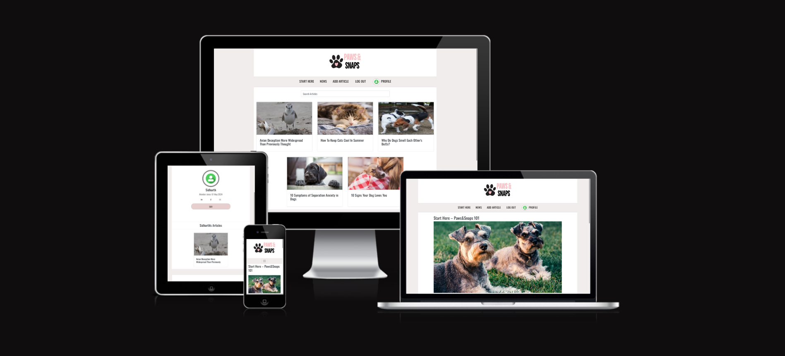
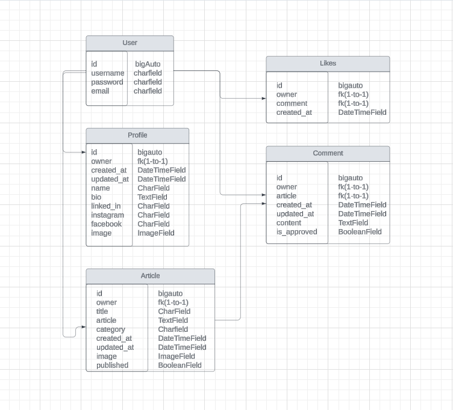

# Paws&Snaps - API




🚀[Deployed Frontend Site](https://pawfect-pics-87d81c100ee5.herokuapp.com/)  
💻 [Deployed API](https://paws-and-snaps-d602158cc7f7.herokuapp.com/)  
🔗 [API Repo](https://github.com/sari-rahul/paws-snaps-api)

## Table of Contents

- [About](#about)
- [Database Schema](#database-schema)
- [Technologies Used](#technologies-used)
   * [Languages and Frameworks](#languages-and-frameworks)
   * [Libraries & Tools](#libraries-tools)
   * [Platforms](#platforms)
- [Validation & Testing](#validation-testing)
- [Bugs](#bugs)
- [Project Setup](#project-setup)
- [Deployment](#deployment)
   * [Setup JSON Web Tokens](#setup-json-web-tokens)
   * [Prepare API for deployment to Heroku](#prepare-api-for-deployment-to-heroku)
   * [Deploy to ElephantSQL](#deploy-to-elephantsql)
   * [Create a Heroku app](#create-a-heroku-app)
   * [Confirm the migration](#confirm-the-migration)
   * [Prepare Project for deployment to Heroku](#prepare-project-for-deployment-to-heroku)
   * [Deploying to Heroku](#deploying-to-heroku)
   * [Fix the dj-rest-auth issue with logging out](#fix-the-dj-rest-auth-issue-with-logging-out)
   * [Add ALLOWED_HOSTS and CLIENT_ORIGIN_DEV to settings.py](#add-allowed_hosts-and-client_origin_dev-to-settingspy)

## About
Paws & Snaps is a dedicated platform for pet lovers and enthusiasts, offering a vibrant space to share stories, tips, and experiences related to our furry friends. Inspired by the unconditional love and joy that pets bring to our lives, Paws & Snaps aims to foster a supportive community where pet owners can connect, learn, and celebrate the bond with their beloved companions.

Key Features:

-   Blogging Platform: Share your pet-related stories, adventures, and insights through engaging blog posts enriched with photos.
-   Interactive Community: Connect with fellow pet lovers through likes, comments, and sharing posts, creating a dynamic and interactive environment.
-   Search and Discovery: Explore a wide range of pet-related topics, from training tips to heartwarming rescue stories, using intuitive search and discovery tools.
-   Personalized Profiles: Customize your profile to showcase your pets, interests, and contributions to the community, fostering connections with like-minded individuals.

## Database Schema



- To create a new app for a new model  
`python manage.py startapp <appname>`  
Then add it to the `INSTALLED_APPS` list in settings.py

- To migrate the changes to the database  
`python manage.py makemigrations`  
`python manage.py migrate`

- To create a superuser  
`python manage.py createsuperuser`

## Technologies Used

- A full list of the requirements and the versions used can be found in the requirements.txt file.  
The requirements.txt file can be created/updated by running the following command:  
```
pip freeze > requirements.txt
```
To install the requirements use the command, make sure your venv is activated  
```
pip install -r requirements.txt
```  
### Languages and Frameworks

- Python
- [Django Rest Framework](https://www.django-rest-framework.org/)  
```
pip install djangorestframework
```

### Libraries & Tools

- [Cloudinary](https://cloudinary.com/) - Image storage
- [Pillow](https://pypi.org/project/pillow/) - Image processing
- [Django Rest Auth](https://www.django-rest-framework.org/api-guide/authentication/#django-rest-auth-dj-rest-auth) - Authentication
- [Django AllAuth](https://docs.allauth.org/en/latest/index.html) - Authentication
- [Psycopg2](https://pypi.org/project/psycopg2/2.9.3/) - Python PostgreSQL Database Adapter
- [Cors Headers](https://github.com/adamchainz/django-cors-headers) - Cross-Origin Resource Sharing
- [Gunicorn](https://pypi.org/project/gunicorn/20.1.0/) - Python WSGI HTTP Server
- [PostgreSQL](https://www.postgresql.org/) - Database
- [Lucid Chart](https://lucid.app/) - Database schema design

### Platforms

- Cloudinary - Storage of image files
- [Github](https://github.com/) - Repository with Git version control
- [GitPod](https://gitpod.io/) - Virtual IDE used for development
- [ElephantSQL](https://customer.elephantsql.com/login) - Hosting of DRF database
- [Heroku](https://dashboard.heroku.com/apps) - Hosting of deployed DRF database

## Validation & Testing

- All files were passed through the [Code Institute PEP8 Validation Tool](https://pep8ci.herokuapp.com/) and came back with no errors, with the exception of some lines being too long in settings.py. As these were URL's and could not be shortened I decided to leave them in.
- Both Unit and Manual Testing were completed.

- For details on testing see the [Testing File](TESTING.md)

## Bugs

There are no known unfixed bugs.

## Project Setup

1. Use the [Code Institute Template](https://github.com/Code-Institute-Org/gitpod-full-template) to create a new repository on GitHub.
2. Install Django Rest Framework with the following command
    ```
    pip3 install 'django<4
    ```
3. Initialize the project with the following command
    ```
    django-admin startproject paws_and_snaps_api .
    ```
4. Install Django Cloudinary Storage for image storage with the following command
    ```
    pip install django-cloudinary-storage
    ```
5. Install Pillow for image processing with the following command
    ```
    pip install Pillow
    ```
6. Add `cloudinary` and `cloudinary_storage` to `INSTALLED_APPS` in settings.py with `django.contrib.staticfiles` between them
    ```
    INSTALLED_APPS = [
        'django.contrib.admin',
        'django.contrib.auth',
        'django.contrib.contenttypes',
        'django.contrib.sessions',
        'django.contrib.messages',
        'cloudinary_storage', 
        'django.contrib.staticfiles',
        'cloudinary',
    ]
    ```
7. Create an env.py file in the base directory and add `import os` at the top, then add the cloudinary API Environment variable
    ```
    import os

    os.environ['CLOUDINARY_URL'] = '<Cloudinary API Environment variable>'
    ```
8. Back in settings.py 
    - add import os and env.py (if it it present)
    - set `CLOUDINARY_STORAGE` to the `CLOUDINARY_URL`
    - set `MEDIA_URL` so the settings knows where to put the image files
    - set the `DEFAULT_FILE_STORAGE` to `cloudinary_storage.storage.MediaCloudinaryStorage`
    ```
    import os

    if os.path.exists('env.py'):
        import env

    CLOUDINARY_STORAGE = {
        'CLOUDINARY_URL': os.environ.get('CLOUDINARY_URL')
    }
    MEDIA_URL = '/media/'
    DEFAULT_FILE_STORAGE = 'cloudinary_storage.storage.MediaCloudinaryStorage'
    ```

## Deployment

### Setup JSON Web Tokens
1. install JSON Web Token authentication run terminal command:  
    ```
    pip install dj-rest-auth==2.1.9
    ```
2. Add 'rest_framework.authtoken' and 'dj_rest_auth' to the list of INSTALLED_APPS in settings.py as below:
    ```
    INSTALLED_APPS = [
        'django.contrib.admin',
        'django.contrib.auth',
        'django.contrib.contenttypes',
        'django.contrib.sessions',
        'django.contrib.messages',
        'cloudinary_storage',
        'django.contrib.staticfiles',
        'cloudinary',
        'location_field.apps.DefaultConfig',
        'rest_framework',
        'django_filters',
        'rest_framework.authtoken',
        'dj_rest_auth',
        ...
    ]
    ```
3. Add the dj-rest-auth urls paths to the main urls.py file as below:
    ```
    urlpatterns = [
        path('admin/', admin.site.urls),
        path('api-auth/', include('rest_framework.urls')),
        path('dj-rest-auth/', include('dj_rest_auth.urls')),
        ...
    ]
    ```

4. Migrate the database with terminal command:  
    ```
    python manage.py migrate
    ```

5. For users to be able to register, install Django AllAuth with terminal command:  
    ```
    pip install 'dj-rest-auth[with_social]'
    ```

6. Add the following INSTALLED_APPS to settings.py:  
    ```
    'django.contrib.sites',
    'allauth',
    'allauth.account',
    'allauth.socialaccount',
    'dj_rest_auth.registration',
    ```
7. Set SITE_ID in settings.py to 1:  
    ```
    SITE_ID = 1

    ```
8. Add the registration urls below to the main urls.py file:  
    ```
    path(
            'dj-rest-auth/registration/', include('dj_rest_auth.registration.urls')
        ),
    ```

9. To install the JSON tokens, run terminal command:  
    ```
    pip install djangorestframework-simplejwt
    ```

10. Set DEV to 1 in the env.py file:  
    ```
    os.environ['DEV'] = '1'
    ```

11. This value can be used to check if project is in development or production. Add the following if/else statement to settings.py:
    ```
    REST_FRAMEWORK = {
        'DEFAULT_AUTHENTICATION_CLASSES': [(
            'rest_framework.authentication.SessionAuthentication'
            if 'DEV' in os.environ
            else 'dj_rest_auth.jwt_auth.JWTCookieAuthentication'
        )],
    }
    ```

12. - To enable token authentication, set `REST_USE_JWT` to `True`.  
    - To ensure tokens are sent over HTTPS only, set `JWT_AUTH_SECURE` to `True`.  
    - Cookie names must also be declared. To do all of this, add the following code below the if/else statement just added to settings.py:
    ```
    REST_USE_JWT = True
    JWT_AUTH_SECURE = True
    JWT_AUTH_COOKIE = 'my-app-auth'
    JWT_AUTH_REFRESH_COOKIE = 'my-refresh-token'
    ```

13. Create serializers.py file in the main app directory (drf_highlights), and copy UserDetailsSerializer code from Django documentation as follows:
    ```
    from dj_rest_auth.serializers import UserDetailsSerializer
    from rest_framework import serializers


    class CurrentUserSerializer(UserDetailsSerializer):
        profile_id = serializers.ReadOnlyField(source='profile.id')
        profile_image = serializers.ReadOnlyField(source='profile.image.url')

        class Meta(UserDetailsSerializer.Meta):
            fields = UserDetailsSerializer.Meta.fields + (
                'profile_id', 'profile_image'
            )
    ```

14. Overwrite the default user detail serializer in settings.py with the following:  
    ```
    REST_AUTH_SERIALIZERS = {
        'USER_DETAILS_SERIALIZER': 'drf_highlights.serializers.CurrentUserSerializer'
    }
    ```

15. Migrate the database again with command:  
    ```
    python manage.py migrate
    ```

16. Update requirements.txt file with new dependencies by running command:  
    ```
    pip freeze > requirements.txt
    ```

17. Add, commit and push changes.

### Prepare API for deployment to Heroku

1. To add a custom message to the root_route, create a views.py file in the drf_highlights directory and add the following code:
    ```
    from rest_framework.decorators import api_view
    from rest_framework.response import Response


    @api_view()
    def root_route(request):
        return Response({
            "message": "Welcome to The Highlights DRF API!"
        })
    ```

2. Import it into the main urls.py file, and add the following to the top of the urlpatterns list:  
    ```
    from .views import root_route

    urlpatterns = [
        path('', root_route),
        ...
    ]
    ```

3. To set up page pagination, inside settings.py add the following to REST_FRAMEWORK:  
    ```
    REST_FRAMEWORK = {
        'DEFAULT_AUTHENTICATION_CLASSES': [(
            'rest_framework.authentication.SessionAuthentication'
            if 'DEV' in os.environ
            else 'dj_rest_auth.jwt_auth.JWTCookieAuthentication'
        )],
        'DEFAULT_PAGINATION_CLASS':
        'rest_framework.pagination.PageNumberPagination',
        'PAGE_SIZE': 10,
    }
    ```
4. Set the default renderer to JSON for the production environment. In settings.py add the following:  
    ```
    if 'DEV' not in os.environ:
        REST_FRAMEWORK['DEFAULT_RENDERER_CLASSES'] = [
            'rest_framework.renderers.JSONRenderer',
        ]
    ```

5. To set up DATETIME_FORMAT, add the following to settings.py (inside REST_FRAMEWORK, under PAGE_SIZE):  
    ```
    'DATETIME_FORMAT': '%d %b %y',

    ```
6. To show how long ago a comment was created, set DATETIME format inside the serializers.py file within the comments app:  
    ```
    from django.contrib.humanize.templatetags.humanize import naturaltime

    created_on = serializers.SerializerMethodField()
    updated_on = serializers.SerializerMethodField()

        def get_created_on(self, obj):
            """Method to display when comment was posted"""
            return naturaltime(obj.created_on)

        def get_updated_on(self, obj):
            """Method to display when comment was updated"""
            return naturaltime(obj.updated_on)

    ```

7. Add, commit and push changes.

### Deploy to ElephantSQL

1. Log into ElephantSQL and create a new instance.

2. Select the free plan.

3. Select a local region.

4. Click on 'Create Instance'

5. Back on the dashboard click on the instance you just created.

6. In the URL section, click the copy icon to copy the database URL.

### Create a Heroku app

1. Log into Heroku.

2. Create a new app.

3. Go to `Settings`, click on `Reveal Config Vars` and add the ElephantSQL `DATABASE_URL` (without any quotes).

4. In the terminal, install dj_database_url and psycopg2, both of these are needed to connect to your external database: 
```
pip3 install dj_database_url==0.5.0 psycopg2
```

5. In your settings.py file, import dj_database_url underneath the import for os:
```
import os
import dj_database_url
```

6. Update the DATABASES section to the following:
```
if 'DEV' in os.environ:
    DATABASES = {
        'default': {
            'ENGINE': 'django.db.backends.sqlite3',
            'NAME': BASE_DIR / 'db.sqlite3',
    }
}
else:
    DATABASES = {
        'default': dj_database_url.parse(os.environ.get("DATABASE_URL"))
    }
```  
This will ensure that when you have an environment variable for `DEV` in your environment the code will connect to the sqlite database here in your IDE. Otherwise it will connect to your external database, provided the `DATABASE_URL` environment variable exist.

7. In your env.py file, add a new environment variable with the key set to `DATABASE_URL`, and the value to your ElephantSQL database URL:
```
os.environ['DATABASE_URL'] = "<your PostgreSQL URL here>"
```  
Remember to add quotes as this needs to be a string.

8. Temporarily comment out the DEV environment variable so that your IDE can connect to your external database:
```
import os

os.environ['CLOUDINARY_URL'] = "cloudinary://..."
os.environ['SECRET_KEY'] = "..."
# os.environ['DEV'] = '1'
os.environ['DATABASE_URL'] = "postgres://..."
```

9. Back in your settings.py file, add a print statement to confirm you have connected to the external database
```
else:
    DATABASES = {
        'default': dj_database_url.parse(os.environ.get("DATABASE_URL"))
    }
    print('connected')
```

10. In the terminal, -–dry-run your makemigrations to confirm you are connected to the external database:  
```
python3 manage.py makemigrations --dry-run
```  
If you are, you should see the ‘connected’ message printed to the terminal.

11. Remove the print statement.

12. Migrate your database models to your new database:
```
python3 manage.py migrate
```

13. Create a superuser for your new database:
```
python3 manage.py createsuperuser
```


### Confirm the migration

1. On the ElephantSQL page for your database, in the left side navigation, select “BROWSER”

2. Click the Table queries button, select auth_user

3. When you click “Execute”, you should see your newly created superuser details displayed. This confirms your tables have been created and you can add data to your database.

### Prepare Project for deployment to Heroku

1. In the terminal of your IDE workspace, install gunicorn
```
pip3 install gunicorn django-cors-headers
```

2. Update your requirements.txt
```
pip freeze --local > requirements.txt
```

3. Heroku also requires a `Procfile`. Create this file now. Remember, it must be named correctly and not have any file extension, otherwise Heroku won’t recognise it

4. Inside the Procfile, add these two commands
```
release: python manage.py makemigrations && python manage.py migrate
web: gunicorn drf_highlights.wsgi
```  
Save the file.

5. In your settings.py file, update the value of the `ALLOWED_HOSTS` variable to include your Heroku app’s URL
```
ALLOWED_HOSTS = ['localhost', '<your_app_name>.herokuapp.com']
```

6. Add corsheaders to `INSTALLED_APPS`:
```
INSTALLED_APPS = [
    ...
    'dj_rest_auth.registration',
    'corsheaders',
    ...
]
```
7. Add corsheaders middleware to the TOP of the `MIDDLEWARE`:
```
MIDDLEWARE = [
    'corsheaders.middleware.CorsMiddleware',
    ...
]
```

8. Under the `MIDDLEWARE` list, set the `ALLOWED_ORIGINS` for the network requests made to the server with the following code:
```
if 'CLIENT_ORIGIN' in os.environ:
    CORS_ALLOWED_ORIGINS = [
        os.environ.get('CLIENT_ORIGIN')
    ]
else:
    CORS_ALLOWED_ORIGIN_REGEXES = [
        r"^https://.*\.gitpod\.io$",
    ]
```  
Here the allowed origins are set for the network requests made to the server. The API will use the `CLIENT_ORIGIN` variable, which is the front end app's url. We haven't deployed that project yet, but that's ok. If the variable is not present, that means the project is still in development, so then the regular expression in the else statement will allow requests that are coming from your IDE.

9. Enable sending cookies in cross-origin requests so that users can get authentication functionality
```
else:
    CORS_ALLOWED_ORIGIN_REGEXES = [
        r"^https://.*\.gitpod\.io$",
    ]

CORS_ALLOW_CREDENTIALS = True
```

10. To be able to have the front end app and the API deployed to different platforms, set the `JWT_AUTH_SAMESITE` attribute to `'None'`. Without this the cookies would be blocked.
```
JWT_AUTH_COOKIE = 'my-app-auth'
JWT_AUTH_REFRESH_COOKE = 'my-refresh-token'
JWT_AUTH_SAMESITE = 'None'
```
11. Remove the value for `SECRET_KEY` and replace with the following code to use an environment variable instead.
```
SECRET_KEY = os.getenv('SECRET_KEY')
```

12. Set a NEW value for your `SECRET_KEY` environment variable in env.py, do NOT use the same one that has been published to GitHub in your commits  
[Django Secret Key Generator](https://djecrety.ir/)  
```
os.environ.setdefault("SECRET_KEY", "CreateANEWRandomValueHere")
```

13. Set the `DEBUG` value to be `True` only if the `DEV` environment variable exists. This will mean it is True in development, and False in production.
```
DEBUG = 'DEV' in os.environ
```

14. Comment `DEV` back in env.py
```
import os

os.environ['CLOUDINARY_URL'] = "cloudinary://..."
os.environ['SECRET_KEY'] = "..."
os.environ['DEV'] = '1'
os.environ['DATABASE_URL'] = "postgres://..."
```

15. Ensure the project requirements.txt file is up to date. In the IDE terminal of your DRF API project enter the following:
```
pip freeze --local > requirements.txt
```

16. Add, commit and push your code to GitHub

### Deploying to Heroku

1. Back on the Heroku dashboard for your new app, open the Settings tab.

2. Add two more Config Vars:
    - `SECRET_KEY` (you can make one up, but don’t use the one that was originally in the settings.py file!)
    - `CLOUDINARY_URL`, and for the value, copy in your Cloudinary URL from your `env.py` file (do not add quotation marks!)
    - You should already have `DATABASE_URL` (postgress) and `DISABLE_COLLECTSTATIC` (set to 1)

3. Open the `Deploy tab`.

4. In the Deployment method section, select `Connect to GitHub`.

5. Search for your repo and click `Connect`.

6. Optional: You can click `Enable Automatic Deploys` in case you make any further changes to the project. This will trigger any time code is pushed to your GitHub repository

7. Under Manual deploy click `Deploy Branch`

8. Your app should be successfully deployed to Heorku. If there was an error and you need to view your logs log in to heroku with the following command:  
```
heroku login
```  
Then to view the logs:  
```
heroku logs --tail --app paws-and-snaps
```
### Fix the dj-rest-auth issue with logging out

1. In paws_and_snaps_api/views.py, import `JWT_AUTH` settings from settings.py.
```
from .settings.responses import (
    JWT_AUTH_COOKIE,
    JWT_AUTH_REFRESH_COOKE,
    JWT_AUTH_SAMESITE,
    JWT_AUTH_SECURE
)
```
2. Write a logout view. That sets the value of both the access token (`JWT_AUTH_COOKIE`) and refresh token (`JWT_AUTH_REFRESH_COOKIE`) to empty strings. We also pass `samesite=JWT_AUTH_SAMESITE`, which we set to `’None’` in settings.py and make sure the cookies are `httponly` and sent over `HTTPS`
```
# dj-rest-auth logout view fix
@api_view(['POST'])
def logout_route(request):
    response = Response()
    response.set_cookie(
        key=JWT_AUTH_COOKIE,
        value='',
        httponly=True,
        expires='Thu, 01 Jan 1970 00:00:00 GMT',
        max_age=0,
        samesite=JWT_AUTH_SAMESITE,
        secure=JWT_AUTH_SECURE
    )
    response.set_cookie(
        key=JWT_AUTH_REFRESH_COOKE,
        value='',
        httponly=True,
        expires='Thu, 01 Jan 1970 00:00:00 GMT',
        max_age=0,
        samesite=JWT_AUTH_SAMESITE,
        secure=JWT_AUTH_SECURE
    )
    return response
```
3. Now that the logout view is there, it has to be included in drf_api/urls.py . The logout_route also needs to be imported.
Inside drf_highlights/urls.py add the following import:
```
from .views import route_route, logout_route
```

4. ... and then included in the `urlpatterns` list. The important thing to note here is that our logout_route has to be placed above the default `dj-rest-auth` urls, so that it is matched first.
```
urlpatterns = [
    ...
    # our logout route has to be above the default one to be matched first
    path('dj-rest-auth/logout/', logout_route),
    path('dj-rest-auth/', include('dj_rest_auth.urls')),
    ...
]
```

5. Add, commit and push your code to GitHub.

6. Redeploy to Heroku.

### Add ALLOWED_HOSTS and CLIENT_ORIGIN_DEV to settings.py

1. In settings.py, in the `ALLOWED_HOSTS` list, copy your ‘... .herokuapp.com’ string.
2. Log in to heroku.com and select your API application.
3. Click `settings`
4. Click `Reveal config vars`
5. Add the new key of `ALLOWED_HOST` with the value for your deployed Heroku application URL that we copied from settings.py
6. Back in settings.py, replace your `ALLOWED HOSTS` list '... .herokuapp.com' string we just copied with the `ALLOWED_HOST` environment variable.
```
ALLOWED_HOSTS = [
    os.environ.get('ALLOWED_HOST'),
    'localhost',
]
```
In order to make our application more secure and accommodate the way Gitpod works by changing the workspace URL regularly, the below code has been provided for you to add to your project.

The following code works as follows:
a) When the `CLIENT_ORIGIN_DEV` environment variable is defined, the unique part of your gitpod preview URL is extracted.
b) It is then included in the regular expression provided by us so that the gitpod workspace is still connected to our API when gitpod rotates the workspace URL.

1. Import the regular expression module at the top of your settings.py file. We will need this to manipulate the `CLIENT_ORIGIN_DEV` URL string.
```
import re
```

2. Replace the else statement and body for `if 'CLIENT_ORIGIN' in os.environ:` with the following code:
```
if 'CLIENT_ORIGIN_DEV' in os.environ:
    extracted_url = re.match(r'^.+-', os.environ.get('CLIENT_ORIGIN_DEV', ''), re.IGNORECASE).group(0)
    CORS_ALLOWED_ORIGIN_REGEXES = [
        rf"{extracted_url}(eu|us)\d+\w\.gitpod\.io$",
    ]
```

3. Add, commit and push your changes.


